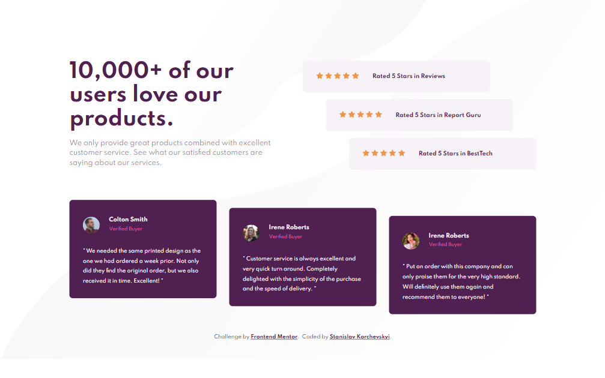

# Frontend Mentor - Social proof section solution

## Welcome! 👋

This is my solution for the challenge from [Frontend Mentor](https://www.frontendmentor.io).

**The challenge was to build out the responsive page and got it looking as close to the design as possible using HTML and CSS.**

[Check out my solution](https://stanislavcodes.github.io/social-proof-section/)
